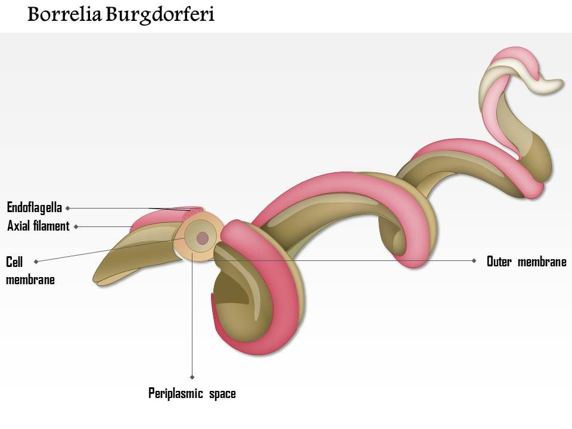

```{r setup, include=FALSE, echo = FALSE}
#Load Stringr package and Data
library("stringr")
MyData = read.csv("Sequences.csv")

#Nucleotide Count Sequence 1
A1 = str_count(MyData[1,3], pattern = "A")
T1 = str_count(MyData[1,3], pattern = "T")
G1 = str_count(MyData[1,3], pattern = "G")
C1 = str_count(MyData[1,3], pattern = "C")

#Nucleotide Count Sequence 2
A2 = str_count(MyData[2,3], pattern = "A")
T2 = str_count(MyData[2,3], pattern = "T")
G2 = str_count(MyData[2,3], pattern = "G")
C2 = str_count(MyData[2,3], pattern = "C")

#Nucleotide Count Sequence 3
A3 = str_count(MyData[3,3], pattern = "A")
T3 = str_count(MyData[3,3], pattern = "T")
G3 = str_count(MyData[3,3], pattern = "G")
C3 = str_count(MyData[3,3], pattern = "C")
```


# Sequences
```{r sequences, include=TRUE, echo = FALSE}
#Converting to character and printing Sequences
print(as.character(MyData[1,3]))
print(as.character(MyData[2,3]))
print(as.character(MyData[3,3]))
```

# Nucleotide Content by Strain
```{r nucleotide, include=TRUE, echo = FALSE, message = FALSE}
# Creating new column and inputting nucleotide counts
library(dplyr)
MyData$Acontent = 0
MyData$Tcontent = 0
MyData$Gcontent = 0
MyData$Ccontent = 0
MyData[1,4] = A1
MyData[1,5] = T1
MyData[1,6] = G1
MyData[1,7] = C1
MyData[2,4] = A2
MyData[2,5] = T2
MyData[2,6] = G2
MyData[2,7] = C2
MyData[3,4] = A3
MyData[3,5] = T3
MyData[3,6] = G3
MyData[3,7] = C3


MyData = select(MyData, Name, Acontent, Tcontent, Gcontent, Ccontent, -X, - Sequence)

print(MyData)


```

# %GC Content by Strain
```{r gc table, include=TRUE, echo = FALSE}
# Creating GC Content table
library(dplyr)
MyData2 = MyData
MyData2$GC_Content = 0
MyData2 = rename(MyData2, Sequence_ID = Name)
#Renaming and arranging
MyData2$Sequence_ID = as.character(MyData2$Sequence_ID)
MyData2[1,1] = "HQ433691.1"
MyData2[2,1] = "HQ433692.1"
MyData2[3,1] = "HQ433694.1"
MyData2 = select(MyData2, Sequence_ID, GC_Content, -Acontent, -Tcontent, -Gcontent, -Ccontent)

#Inputting GC Values
MyData2[1,2] = (((G1+C1)/(A1+T1+G1+C1))*100)
MyData2[2,2] = (((G2+C2)/(A2+T2+G2+C2))*100)
MyData2[3,2] = (((G3+C3)/(A3+T3+G3+C3))*100)

print(MyData2)

```


[Link to more info about species](https://en.wikipedia.org/wiki/Borrelia_burgdorferi)

# %GC Content for other dataset
```{r graph, include=TRUE, echo = FALSE}
#Creating the graph specifications
library(ggplot2)
library(dplyr)
theme_pubworthy <- function (base_size = 12, base_family = "") {
  theme_classic(base_size = base_size, base_family = base_family) %+replace% 
    theme(
      axis.text = element_text(colour = "black"),
      axis.title.x = element_text(size=18),
      axis.text.x = element_blank(),
      axis.title.y = element_text(size=18,angle=90),
      axis.text.y = element_text(size=12),
      axis.ticks = element_blank(), 
      panel.background = element_rect(fill="white"),
      panel.border = element_blank(),
      plot.title=element_text(face="bold", size=24),
      legend.position="right"
    ) 
}

NData = read.csv("GC_content.csv")
NData = mutate(NData, GC = G + C)
qplot(x=ID,y=GC,data=NData,colour = Species, main="%GC Content by species",xlab="Species",ylab="%GC Content") + theme_pubworthy()

```

